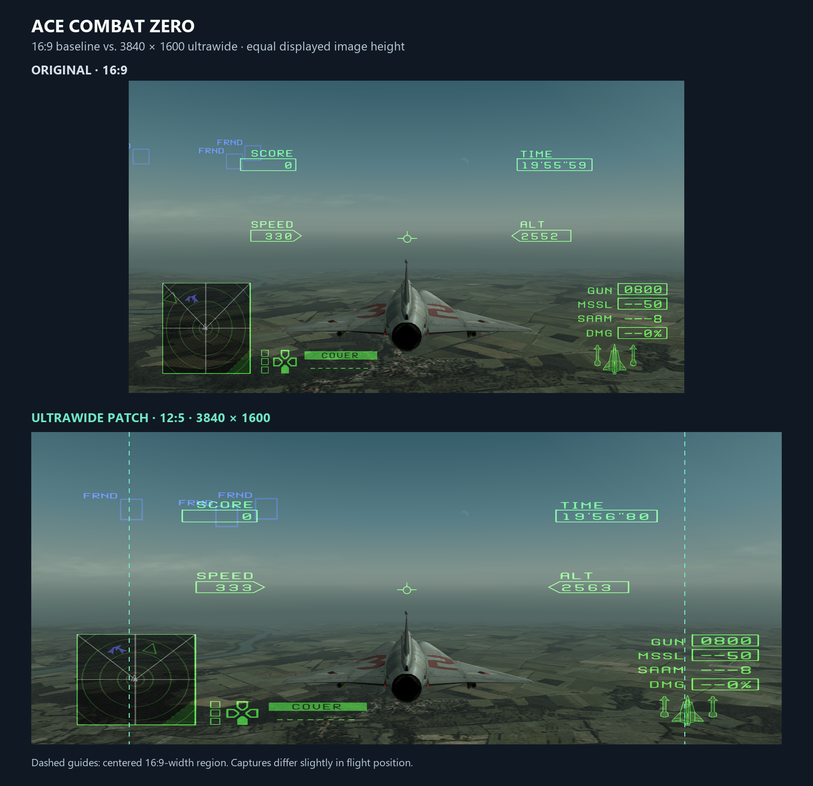

# Ace Combat Zero: The Belkan War [SLUS-21346] (NTSC-U) — Ultrawide patches

By **danyole7**. PCSX2 patches for **SLUS-21346 / CRC 65729657**. Use only this game version; addresses are not portable to other regions or executable revisions.

## Choose a version

| Display ratio | Target resolution | Patch |
| --- | --- | --- |
| 12:5 | 3840×1600 | [Download PNACH](12%3B5/SLUS-21346_65729657.pnach) |
| 21:9 | 3440×1440 | [Download PNACH](21%3B9/SLUS-21346_65729657.pnach) |
| 32:9 | 5120×1440 or 3840×1080 | [Download PNACH](32%3B9/SLUS-21346_65729657.pnach) |

The `21;9` folder targets **3440×1440 (43:18)**, not exact 21:9 (7:3) or 2560×1080. Other resolutions with the same actual ratio use the same patch values.

## Reference comparison

## Installation

1. Download **one** matching PNACH from the table and copy it into PCSX2’s **patches** folder. Keep its filename. If you don't already have a custom patch file for this game, you should be good to go. If you do, **DO NOT OVERWRITE** your patch. You will lose whatever is there. Instead, back it up and manually copy & paste everything under "gametitle=Ace Combat Zero: The Belkan War [SLUS-21346] (NTSC-U)" into your existing file. Replace older versions of these same entries rather than keeping duplicate copies.
2. Enable the matching camera and radio-subtitle entries in the game’s per-game 'Patches' settings (names below). Installing the file does not automatically enable them or change settings. The subtitle correction is optional; enable both entries to use both fixes.
3. Disable competing widescreen, ultrawide or camera/FOV patches, including the **Widescreen 16:9** that should come bundled with PCSX2.
4. Select **Fit to Fullscreen / Stretch** for PCSX2’s output aspect ratio. The actual game presentation area must match the chosen ratio, so make sure to fullscreen the game, or the 3D space will look horizontally compressed. Internal rendering resolution can remain at your preferred setting. **Suggestion**: Set the FMV Aspect Ratio Override in PCSX2 Graphics Settings to 'Native' or 'Widescreen', as 4:3 FMVs stretched to ultrawide...don't look good.
5. Fresh boot the game and load a normal memory-card save. Old emulator savestates can restore previous patch instructions or camera settings.
6. **CRITICAL**: Set the game’s own screen/aspect option to **16:9** in its Display Settings. If you installed this patch and it looks wonky, verify this setting in the in-game Display Settings is set to 16:9.

### Patch entries

- **3840×1600:** `Ultrawide Hor+ 2.4:1 - 3840x1600`, `De-stretch UI - Radio subtitles only - 2.4:1`
- **3440×1440:** `Ultrawide - 3440x1440 (43:18)`, `Radio subtitles - 3440x1440 (43:18)`
- **5120×1440 or 3840×1080:** `Ultrawide - 5120x1440 (32:9)`, `Radio subtitles - 5120x1440 (32:9)`

## Features and limitations

Widens supported gameplay and additional view/replay projection paths while preserving vertical framing. A separate radio-subtitle entry corrects in-game speaker names, underlines, message lines and brackets. **Cutscene subtitles are not corrected.** HUD and menus remain stretched. Pre-rendered movies are not corrected, naturally. Cockpit edge culling is not fixed.

**21:9 and 32:9 have not been tested by me as I do not have monitors with these aspect ratios**. Please let me know if you run into issues with these versions.

## Variant calculations and validation

- Gameplay and additional view widths = 360 × target ratio; the established 16:9 lens calibration and vertical height values are retained.
- Radio-subtitle viewport guards match each variant’s virtual width.
- Subtitle X offsets and applicable clip bounds use signed integer scales of 20/27 for 12:5, 32/43 for 3440×1440, and 1/2 for 32:9, preserving their centers.

The 3440×1440 and 32:9 versions were derived from the existing 3840×1600 patches. Changed constants, injected full-precision loads and subtitle arithmetic were checked offline; neither new ratio has been visually validated in game. 32:9 specifically may expose geometry or clipping issues.

## Credits

- **Based on nemesis2000’s 16:9 projection calibration.**
- **Dipshet:** the [updated Ace Combat Zero ultrawide post (#112, March 3, 2026)](https://forums.pcsx2.net/Thread-PCSX2-Ultrawide-Eyefinity-Patches?page=12) identified the viewport constants used as our starting point. Their published width of 860 was adjusted to 864 for the exact 12:5 target.
- **danyole7:** ultrawide adaptation, radio-subtitle correction and testing.
